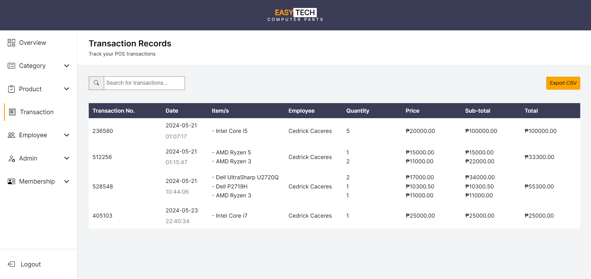

 <div align="center">
  <h2>Point of Sale System using Laravel Breeze</h2>
</div>

This project was created as part of a school requirement to demonstrate my knowledge about Laravel. It aims to provide a practical application of the theories I learned in my class. The project is designed to be easy to use and understand, making it a helpful resource for students and educators alike.


## Installation

To get a local copy up and running follow these simple steps:

### Prerequisites

- PHP 7.4 or higher
- Composer
- Node.js and npm
- MySQL or any other supported database

### Steps

1. Clone the repository
   ```sh
   git clone https://github.com/Ceft7412/Point-of-Sale-Computer-Parts.git

   ```
   or download the zip file and extract it to your desired directory.
   
2. Navigate to the project directory

   ```sh
   cd Point-of-Sale-Computer-Parts
   ```

3. Install PHP dependencies

   ```sh
   composer install
   ```

4. Install NPM package

   ```sh
   npm install
    npm run dev
   ```

5. Copy the example environment file(.env.example and create and set up your environment variables in the root folder(.env)

   ```sh
   cp .env.example .env
   ```

6. Generate an application key

   ```sh
   php artisan key:generate
   ```

7. Set up your database configuration in the .env file and run the migrations

   ```sh
   php artisan migrate
   ```

   ```sh
   php artisan db:seed --class=AdminUserSeeder
   ```

8. Serve the application

   ```sh
   php artisan serve
   ```

### Usage
```
php artisan serve
```

Then, open your browser and go to http://localhost:8000.

### Login using Default Admin

Admin Username: admin<br />
Admin Password: admin


### Screenshots

#### Login Page
<div align="center">
  
  <p>Login View</p>
</div>


#### Admin Pages
<div align="center">
  
  <p>Overview View</p>
</div>

<div align="center">
  
  <p>Category View</p>
</div>

<div align="center">
  
  <p>Brands View</p>
</div>

<div align="center">
  
  <p>Product View</p>
</div>

<div align="center">
  
  <p>Transaction View</p>
</div>

<div align="center">
  
  <p>Admin View</p>
</div>

<div align="center">
  
  <p>Employee View</p>
</div>

<div align="center">
  
  <p>Membership View</p>
</div>

<div align="center">
  
  <p>Add View</p>
</div>

<div align="center">
  
  <p>Update View</p>
</div>

#### Employee's/Cashier's Page

<div align="center">
  
  <p>Cashier View</p>
</div>
<div align="center">
  
  <p>Cashier Pay View</p>
</div>
<div align="center">
  
  <p>Cashier Apply View</p>
</div>
<div align="center">
  
  <p>Cashier Request View</p>
</div>
### Contact

cedrick.caceres741@gmail.com
   

